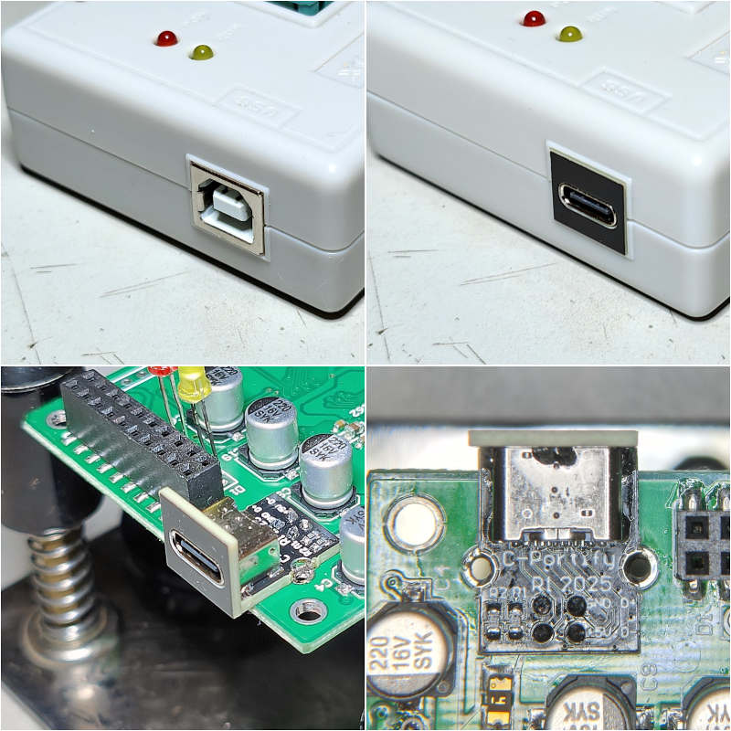
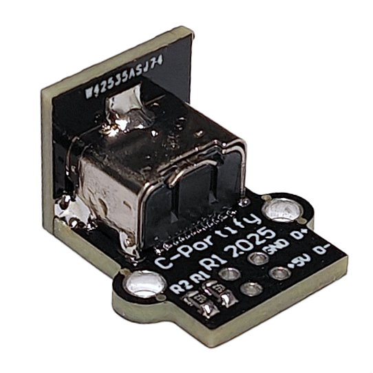
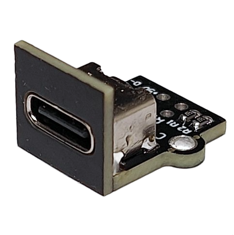
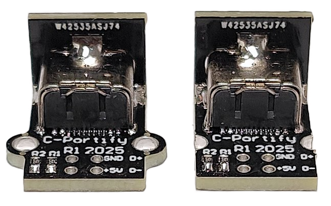

# C-Portify

C-Portify is a USB-B to USB-C conversion kit. It can replace a through hole USB-B connector.

    

Order from PCBway or download the gerber files and order from your preferred PCB fab. 
Links to PCBway: <a href="https://www.pcbway.com/project/shareproject/C_Portify_USB_B_to_USB_C_conversion_kit_7428d869.html">main PCB</a> & <a href="https://www.pcbway.com/project/shareproject/Front_panel_for_C_Portify_d39ce92c.html">face plate PCB</a>. 
Notice the main PCB is standard 1.6mm thick but the face plate is 1.2 mm thick. 

## Assembly
Solder the connector J1 and resistors R1 & R2 into place. Add good amount of solder to the face plate top solder pad. Support the face plate agains something vertical. Solder the face plate top solder pad to the connector on the main PCB. Check alignment and fix if needed. Solder the face plate side pads to the main PCB. Notice you can also leave out the face plate if you don't need it like on some PCB without any enclosure. 

  
   

## Installation
The C-Portify has two arcs on the sides. They can be left as such or they can be cut away. The PCB was first designed with castellated holes but it increased production costs.

    

Desolder the USB-B connector and clean the PCB holes. Align C-portify holes with the device PCB holes. Solder only one of the side holes. Verify placement before soldering the rest of the holes. Use a piece of wire or a cut through hole component pin for the four smaller holes.

## Buy C-Portify
I have some extra PCBs available from my first order. I can sell DIY kits with loose parts for 10€ for 3 kits. Assembled (parts and front panel soldered) kits for 15€ for 3pcs. Only EU area at the moment. Shipping via priority letter. Shipping fees added.
Email me at 1c3d1v3r [at] gmail [dot] com if interested.

### Licence

C-Portify by <a rel="cc:attributionURL dct:creator" property="cc:attributionName" href="https://github.com/1c3d1v3r/">Pasi Lassila</a> is licensed under <a href="http://creativecommons.org/licenses/by-sa/4.0/?ref=chooser-v1" target="_blank" rel="license noopener noreferrer" style="display:inline-block;">CC BY-SA 4.0</a>

